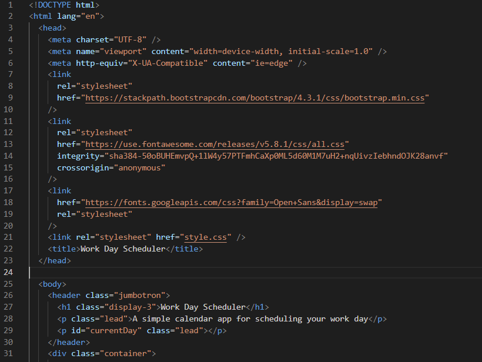

## Goal
The main goal of this project was to create a simple calendar application that allows a user to save events in hourly time blocks, from 9 AM to 5 PM.  

## Why this project was built
The project was made to provide users acess to a simple application that lets them schedule tasks in hour-long blocks, from 9 AM to 5 PM.

## What I learned
In this project, I learned how to use third-party APIs such as Moment.js to handle the date and time for the application, as well as utilize Bootstrap for adjusting the layout of elements. I wish I also figured out how to properly space the rows and columns to make it more like the demonstration.

## Challenges of this project
The challenges I faced with this project was not having as much time as I would like to work on this, and I feel that I did not understand Bootstrap as well as I did, especially with regards to the Grid system and Bootstrap theme colors. 

## Screenshot

## Link to live version
View my Work Day Scheduler Application [here](https://zachary-levin.github.io/zpl-work-day-scheduler-1/). 

## User Story
AS AN employee with a busy schedule
I WANT to add important events to a daily planner
SO THAT I can manage my time effectively

## Acceptance Criteria
GIVEN I am using a daily planner to create a schedule
WHEN I open the planner
THEN the current day is displayed at the top of the calendar
WHEN I scroll down
THEN I am presented with time blocks for standard business hours
WHEN I view the time blocks for that day
THEN each time block is color-coded to indicate whether it is in the past, present, or future
WHEN I click into a time block
THEN I can enter an event
WHEN I click the save button for that time block
THEN the text for that event is saved in local storage
WHEN I refresh the page
THEN the saved events persist